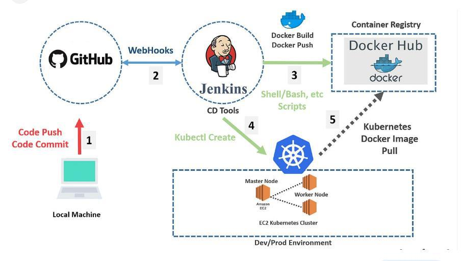
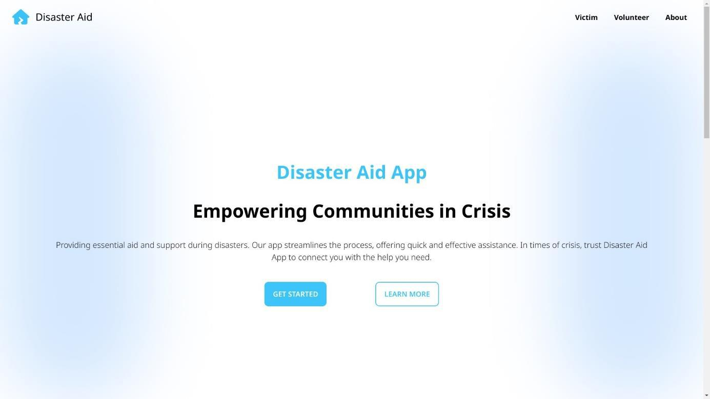
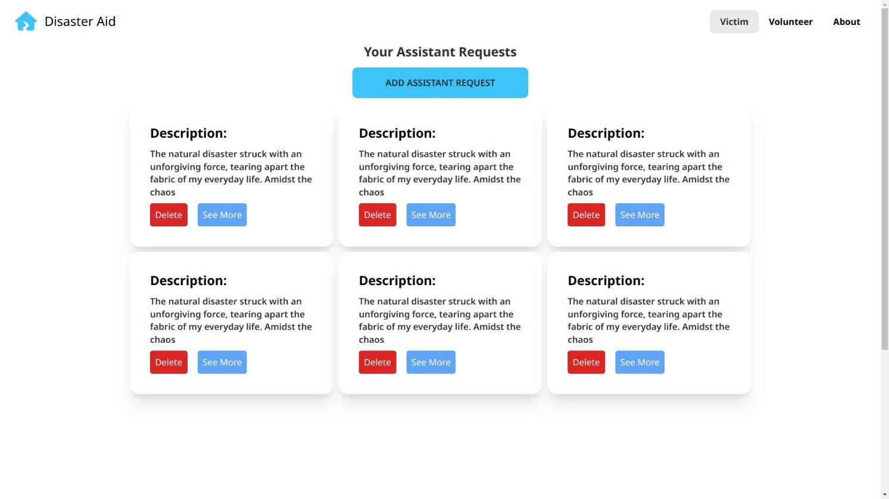
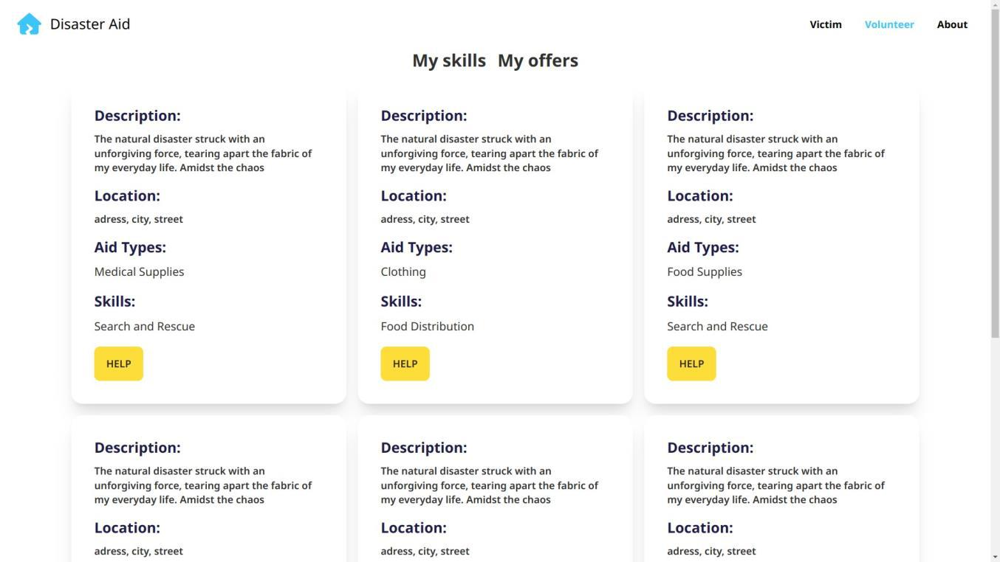

# Disaster Aid Web Application

<!--toc:start-->

- [Disaster Aid Web Application](#disaster-aid-web-application)
  - [Overview](#overview)
  - [Objectives](#objectives)
  - [Architecture](#architecture)
    - [General Architecture](#general-architecture)
      - [Microservices and Front-end Application](#microservices-and-front-end-application)
    - [Technologies Used](#technologies-used)
  - [Key Features](#key-features)
  - [DevOps Implementation](#devops-implementation)
    - [DevOps Workflow](#devops-workflow)
  - [Screenshots](#screenshots)
  <!--toc:end-->

## Overview

This project is a web application designed to assist and support victims of natural disasters.The application leverages modern technologies such as Angular, Spring Boot, Docker, Jenkins, and Kubernetes to provide a seamless user experience.

## Objectives

The main goal of this project is to develop a web-based platform that:

- Facilitates quick and significant support for disaster victims.
- Utilizes a microservices architecture to ensure flexibility, scalability, and ease of maintenance.
- Offers a user-friendly single-page application (SPA) interface developed with Angular.

## Architecture

### General Architecture

The project uses a microservices architecture to enhance flexibility and scalability. Each microservice manages specific functionalities, communicating through a service registry and an API Gateway.

#### Microservices and Front-end Application

- **Auth Microservice**: Manages user authentication with tokens, providing endpoints for login and signup. [GitHub Repository](https://github.com/FSTT-Disaster-Aid-App/Auth-Microservice)
- **Registry Microservice**: Registers and discovers services, facilitating communication by providing location information. [GitHub Repository](https://github.com/FSTT-Disaster-Aid-App/Registry-Microservice)
- **Gateway Microservice**: Acts as the single entry point, routing requests and managing authentication and authorization. [GitHub Repository](https://github.com/FSTT-Disaster-Aid-App/Gateway-Microservice)
- **Volunteer Microservice**: Handles volunteer-related actions, such as managing skills and donations. [GitHub Repository](https://github.com/FSTT-Disaster-Aid-App/Volunteer-Microservice)
- **Victim Microservice**: Manages victim-related information, including assistant requests, skills, aid types, and locations. [GitHub Repository](https://github.com/FSTT-Disaster-Aid-App/Victim-Microservice)
- **Front-end Application**: Developed with Angular to provide a reactive and user-friendly interface. [GitHub Repository](https://github.com/FSTT-Disaster-Aid-App/Frontend)

### Technologies Used

- **Angular**: A framework for building interactive and reactive web applications.
- **Spring Boot**: Simplifies Java application development, providing ready-to-use features for web and microservices applications.
- **Docker**: Facilitates application development, deployment, and management in lightweight, self-sufficient containers.
- **Jenkins**: Automates the build, test, and deployment processes as part of continuous integration and delivery (CI/CD).
- **Kubernetes**: Orchestrates container deployment, scaling, and management, ensuring high availability and efficient load balancing.

## Key Features

- **Personalized Assistance**: Victims can request specific types of aid through the application.
- **Variety of Aid**: Offers various forms of assistance, including financial, logistical, and other supports.
- **Volunteer Engagement**: Encourages volunteer participation to contribute to aid efforts.
- **Detailed Needs Expression**: Victims can detail their specific needs, enabling more precise responses.

## DevOps Implementation

The project employs a comprehensive DevOps strategy using Jenkins, Docker, and Kubernetes to ensure smooth deployment, efficient updates, and optimal application lifecycle management.

### DevOps Workflow

1. **GitHub Commit**: Developers push changes to the GitHub repository.
2. **Automatic Detection by Jenkins**: Jenkins detects new commits and triggers the CI process.
3. **Build with Jenkins**: Jenkins compiles the application.
4. **Docker Image Creation**: Jenkins creates Docker images encapsulating the application and its dependencies.
5. **Deployment on Kubernetes**: Docker images are deployed on Kubernetes, which manages container orchestration and scaling.
6. **Automated Container Management**: Kubernetes ensures high availability, load balancing, and efficient failure management.

## Screenshots

Here are some screenshots of the Disaster Aid Web Application:

